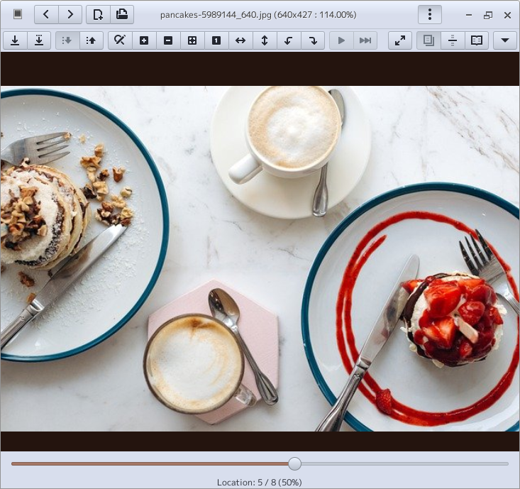
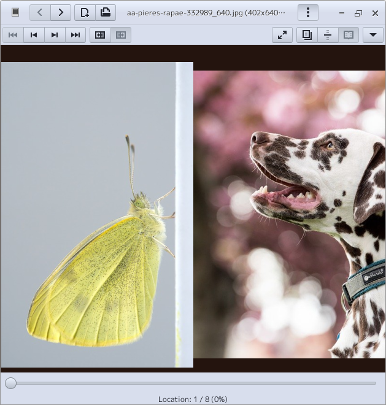

ParaPara
================================================================================

Description
--------------------------------------------------------------------------------

_ParaPara_ is an image viewer created with lightweight and high-speed operation in mind.

It is supposed to be linked to the extension and opened by double-clicking from your
favorite file manager.

By displaying the two images on the left and right,
you can also see manga in a two-page spread.
You can switch between right-to-left and left-to-right page turning.

Screenshot
--------------------------------------------------------------------------------

Spread display is also possible.

continuous mode (vertical).

")

continuous mode (horizontal).

")

Key Combinations
--------------------------------------------------------------------------------

### General key combinations.

+ _Ctrl + N_  
  Open new window.
+ _Ctrl + W_  
  Close this window.
+ _Ctrl + Q_  
  Close all windows and quit this application.
+ _Ctrl + O_  
  Choose an image on your file system and open it.
+ _← (left arrow key)_  
  go backward (if the sort order is ascending)  
  go forward (if the sort order is descending)
+ _→ (right arrow key)_  
  go forward (if the sort order is ascending)  
  go backward (if the sort order is descending)

### Shortcut key in single view mode

+ _Ctrl + S_  
  Save this picture.
+ _Ctrl + Shift + S_  
  Save this picture as another name.
+ _Ctrl + 0_  
  Show this picture as original size
+ _Ctrl + 1_  
  Show this picture as fitting this window.
+ _Ctrl + +_  
  Zoom in
+ _Ctrl + -_  
  Zoom out
+ _Ctrl + H_  
  Invert horizontally
+ _Ctrl + V_  
  Invert vertically
+ _Ctrl + R_  
  Rotate 90 degrees clockwise
+ _Ctrl + L_  
  Rotate 90 degrees counterclockwise
+ _Ctrl + E_  
  Resize this picture. You can save it later.

### Buttons in dual view mode

+   
  Move two page to the left.
+   
  Move one page to the left.
+   
  Move one page to the right
+   
  Move two page to the right
+   
  Switch "from right to left" reading.
+   
  Switch "from left to right" reading.

Building and Installation
--------------------------------------------------------------------------------

You'll need the following dependencies:

* GCC
* CMake
* Python3
* Meson build system
* GTK+3 _(in Ubuntu, install libgtk-3-dev)_
* Vala compiler _(0.40 or later)_
* Gee (libgee-0.8 or later) _(in Ubuntu install libgee-0.8-dev)_
* Granite _(in Ubuntu install libgranite-dev)_

Run `meson build` to configure the build environment.
Add the build option `-DDEBUG=true` to log debug messages to a file.
Change to the build directory and run `ninja` to build

    meson build --prefix=/usr
    cd build
    ninja

To install, use `ninja install`, then execute with `com.github.aharotias2.parapara`

    ninja install
    com.github.aharotias2.parapara
