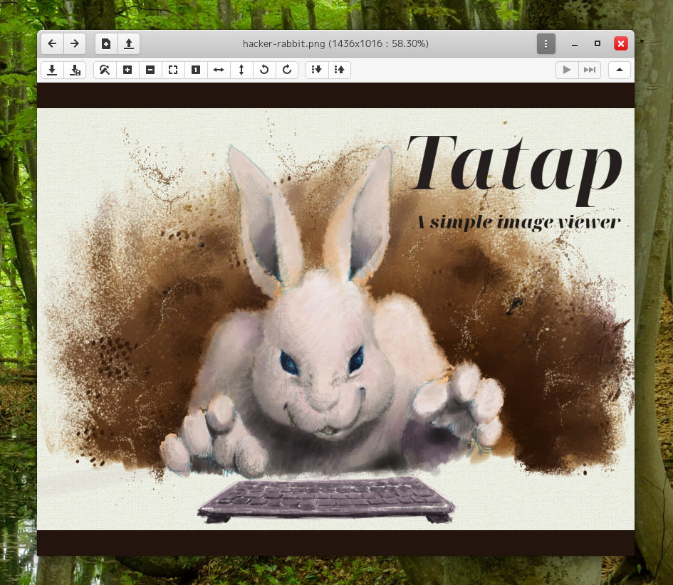

# tatap
A simple picture viewer written in Vala

## Building and Installation
You'll need the following dependencies:

* cmake
* meson
* libgtk-3-dev
* valac
* libgee-0.8-dev
* granite (or libgranite-dev)

Run `meson build` to configure the build environment. Add the build option `-DDEBUG=true` to log debug messages to a file. Change to the build directory and run `ninja` to build

    meson build --prefix=/usr
    cd build
    ninja

To install, use `ninja install`, then execute with `com.github.aharotias2.tatap`

    ninja install
    com.github.aharotias2.tatap
